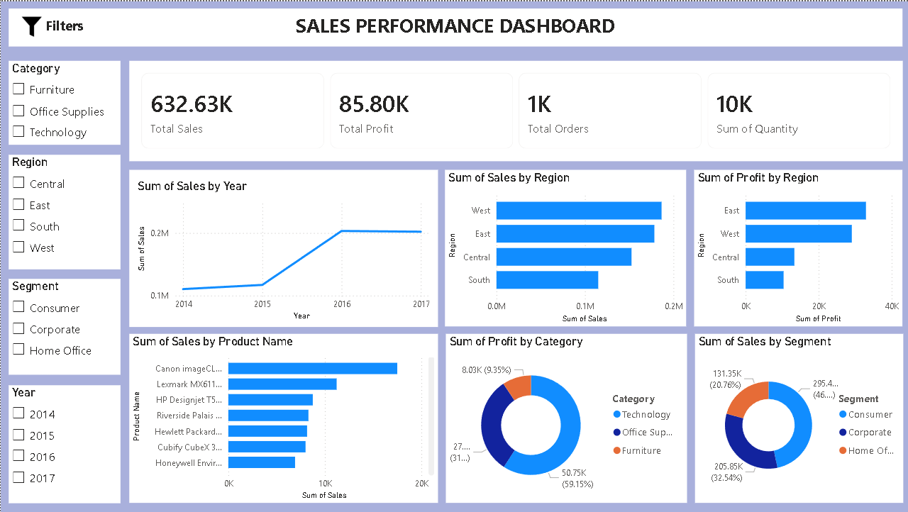

# Sales Performance Dashboard

## Overview

This project is an interactive Sales Performance Dashboard built using Power BI.
The dashboard analyzes sales, profit, customer segments, product performance, and regional trends using a retail superstore dataset.

## Features

* Total Sales, Profit, Orders, and Quantity KPI cards
* Sales Trend Analysis
* Regional Sales & Profit Analysis
* Product Performance Analysis
* Category & Segment Insights
* Interactive Filters/Slicers

## Tools Used

* Power BI
* Excel / CSV Dataset

## Dashboard Preview

## Key Insights

* West region generated the highest sales
* Technology category was highly profitable
* Consumer segment contributed the most revenue
* Discounts negatively impacted profit in many cases

## Files Included

* Power BI dashboard (.pbix)
* Dataset file
* Dashboard screenshot
